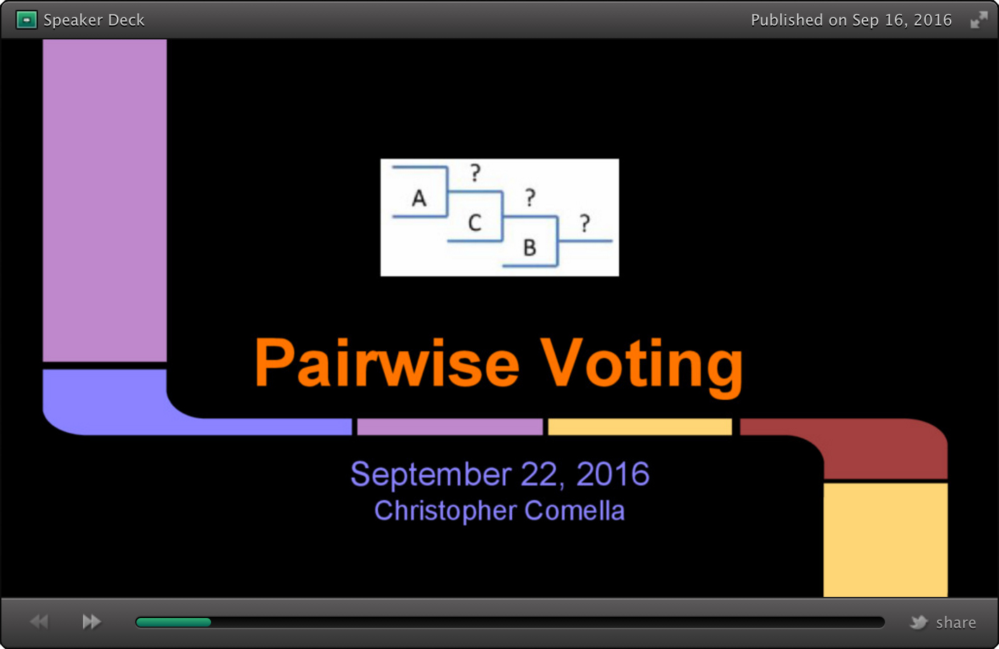

# Pairwise Voting

#### Presentation

  * [Slides](http://speakerdeck.com/chrisco/pairwise-voting) (10 slides)
  * [Proof of concept / prototype demo](https://youtu.be/65QhZWbcWgw) (19 seconds)

#### Description of the MVP

  * The __PairwiseVoting app__ is envisioned as:
    * an [MVP](https://en.wikipedia.org/wiki/Minimum_viable_product) implementation of a __pairwise comparison__ process,
    * built with state-of-the-art architectures and technologies.
  * [Pairwise Comparison](https://en.wikipedia.org/wiki/Pairwise_comparison) is "any process of comparing entities in pairs to judge which of each entity is preferred. The method of pairwise comparison is used in the scientific study of preferences, attitudes, voting systems, social choice, public choice, and multi-agent AI systems." (Source: Wikipedia)

#### Premium feature(s)

The ability to perform statistical analysis on voting results, as may be applicable for certain use cases, such as to determine whether the mean of the differences between two paired samples diverge (to a statistically significant degree). The exact statistical method, and its implementation, will be fleshed out during the product development process, as per the agile process I will use (and the projects constraints). A few of the techniques to be investigated include:
* [Analytic hierarchy process](https://en.wikipedia.org/wiki/Analytic_hierarchy_process)
* [Conjoint analysis](https://www.google.com/search?q=conjoint+analysis)
* [Paired t-test](http://support.minitab.com/en-us/minitab/17/topic-library/basic-statistics-and-graphs/hypothesis-tests/tests-of-means/why-use-paired-t/)
* [Tukey HSD test](http://onlinestatbook.com/2/tests_of_means/pairwise.html)

#### Repos

* This is the __PARENT repo__ of the Pairwise Voting app.
* The __CLIENT repo__ is here: https://github.com/chrisco/pwv-client
* And the __SERVER repo__ is here: https://github.com/chrisco/pwv-server

#### Future Project URLs

  * http://pairwisevoting.com
  * http://pairwisevoting.herokuapp.com
  * http://pairwisevoting.firebase.com

### Who uses it? / What problem does it solve?

Groups who want to easily decide, through pairwise comparison, which one of a set of alternatives to pick.

Some examples:

* The "best" project, logo, song, or movie.
* Which project to build next.
* What food to order for a meeting or event.
* Where to go on a company retreat
* or family vacation.
* And more...

### What outputs do they need?

* One responsive, mobile-first UI to view and vote on each pair of alternatives.
* One UI to view the voting results (in real time).

### What inputs are needed to generate those outputs?

A set of items to vote on, such as a list of capstone projects, lunch options, destinations, or whatever.

### Key technologies

The key technologies and architectures are anticipated to be Node.js, React, Redux, and WebSockets.

### Feature list

1. A User can enter a set of items to vote on.
2. Users can vote view and vote on each pair of items.
3. Voting results are displayed (in real time).
4. The ability to perform statistical analysis on the results, as may be applicable for certain use cases (see "Premium Feature" section, above).
