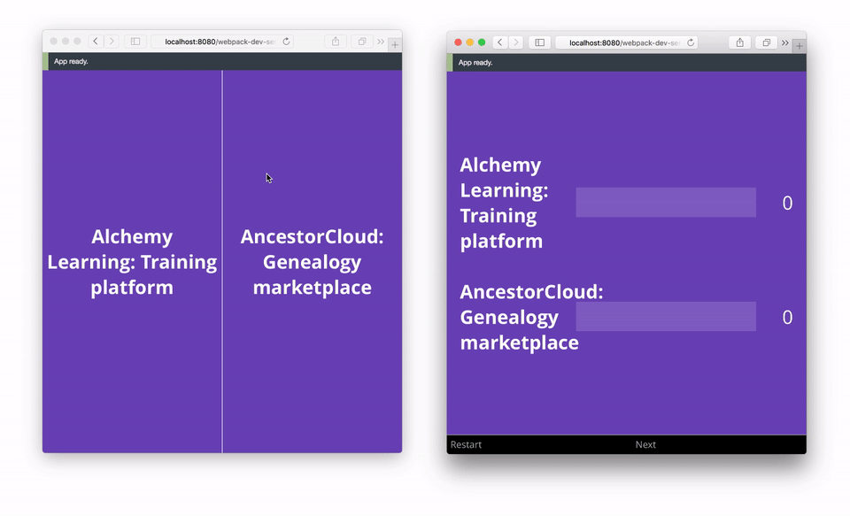

# Pairwise Voting Information Repo

__This__ repo contains general information and links related to the project.

The __SERVER repo__ is here: https://github.com/chrisco/pwv-server

Please see the "Links" section, below, for a video of my presentation.

## Screenshot (animated)

In the image below there are __two__ User Interfaces (connected by [WebSockets](https://developer.mozilla.org/en-US/docs/Web/API/WebSockets_API)):    

1. On the left is the __Voting UI__.
2. On the right is the __Results UI__.

#### Links

  * [My presentation on capstone day](https://youtu.be/AyM2LSS5ipw) (5 minutes)
  * [Slides](http://speakerdeck.com/chrisco/pairwise-voting)
  * [Proof of concept](https://youtu.be/65QhZWbcWgw) (19 seconds)
  * [Admin site](http://www.pairwisevoting.com)

#### Description of the MVP

  * The __PairwiseVoting app__ is:
    * an [MVP](https://en.wikipedia.org/wiki/Minimum_viable_product) implementation of a __pairwise comparison__ process,
    * built with state-of-the-art architectures and technologies.
  * [Pairwise Comparison](https://en.wikipedia.org/wiki/Pairwise_comparison) is "any process of comparing entities in pairs to judge which of each entity is preferred. The method of pairwise comparison is used in the scientific study of preferences, attitudes, voting systems, social choice, public choice, and multi-agent AI systems." (Source: Wikipedia)

#### Premium feature(s)

The ability to perform statistical analysis on voting results, as may be applicable for certain use cases, such as to determine whether the mean of the differences between two paired samples diverge (to a statistically significant degree). The exact statistical method, and its implementation, will be fleshed out during the product development process, as per the agile process I will use (and the projects constraints). A few of the techniques to be investigated include:
* [Analytic hierarchy process](https://en.wikipedia.org/wiki/Analytic_hierarchy_process)
* [Conjoint analysis](https://www.google.com/search?q=conjoint+analysis)
* [Paired t-test](http://support.minitab.com/en-us/minitab/17/topic-library/basic-statistics-and-graphs/hypothesis-tests/tests-of-means/why-use-paired-t/)
* [Tukey HSD test](http://onlinestatbook.com/2/tests_of_means/pairwise.html)

### Who uses it? / What problem does it solve?

Groups who want to easily decide, through pairwise comparison, which one of a set of alternatives to pick.

Some examples:

* The "best" startups or capstone projects at a demo day.
* Which project to build next.
* Who to hire among all the candidates who applied for a position.
* What food to order for a meeting or event.
* Where to go on a company retreat.
* Or family vacation.
* And more...

### What outputs do they need?

* A Voting UI to view and vote on each pair of alternatives.
* A Results UI to view the voting results (in real time).

### What inputs are needed to generate those outputs?

A set of items to vote on (see examples, above).

### Key technologies

The key technologies and architectures are anticipated to be [Node.js](https://nodejs.org/en/), [React](https://facebook.github.io/react/), [Redux](http://redux.js.org/), and [WebSockets](https://developer.mozilla.org/en-US/docs/Web/API/WebSockets_API).

### Feature list

1. An Admin User can enter a set of items to vote on.
2. Users can vote view and vote on each pair of items.
3. Voting results are displayed (in real time).
4. Other features to be developed through customer discovery and customer development (i.e., [Lean Startup](https://en.wikipedia.org/wiki/Lean_startup)).
5. The ability to perform statistical analysis on the results, as may be applicable for certain use cases (see "Premium Feature" section, above).
